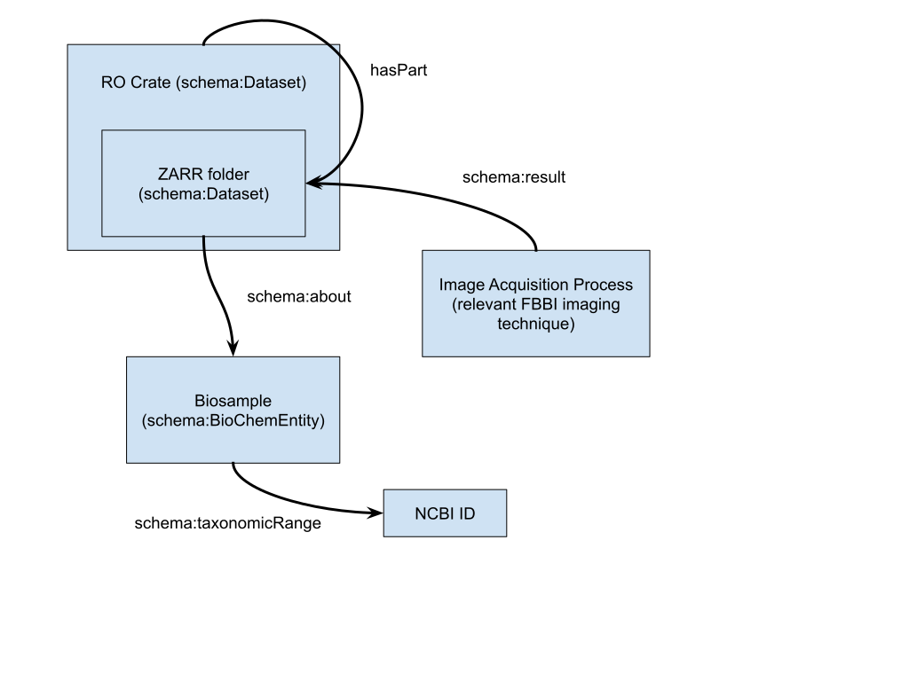
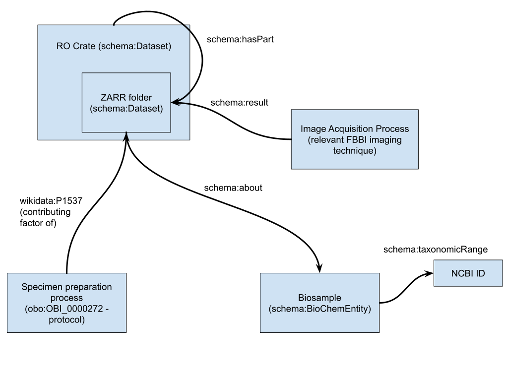

# RO-Crate metadata minimal design

RO-Crate provides a mechanism to package data together with metadata. In general
this looks like a directory of files (or sub-directories) with an
ro-crate-metadata.json to describe the files. We want to test mechanisms for
storing extensible metadata alongside the OME-Zarr images. This document
proposes a minimal schema for the ro-crate-metadata.json focused on describing
what was imaged and the imaging technique.

**_Relevant links_**

RO crate: https://www.researchobject.org/ro-crate/ json-ld syntax:
https://www.w3.org/TR/json-ld/ json-ld playground:
https://json-ld.org/playground/

**_Proposal for a minimal metadata structure_**

The json payload below follows the RO-Crate guidance. It contains an object per
'thing that was imaged' (instance of schema:BioChemEntity), linked to its NCBI
taxon\*, an object per 'imaging technique' which has a type of the relevant FBBI
imagining technique.

\*note that the NCBI taxon may also be 'non organismal' for synthetic entities.

```
{
    "@context": [
        "https://w3id.org/ro/crate/1.1/context",
        {
            "organism_classification": "https://schema.org/taxonomicRange",
            "BioChemEntity": "https://schema.org/BioChemEntity",
            "obo": "http://purl.obolibrary.org/obo/",
            "acquisiton_method": {
                "@reverse": "https://schema.org/result",
                "@type": "@id"
            },
            "biological_entity": "https://schema.org/about"
        }
    ],
    "@graph": [
        {
            "@type": "CreativeWork",
            "@id": "ro-crate-metadata.json",
            "conformsTo": {
                "@id": "https://w3id.org/ro/crate/1.1"
            },
            "about": {
                "@id": "./"
            }
        },
        {
            "@id": "./",
            "@type": "Dataset",
            "name": "Light microscopy photo of a fly",
            "description": "Light microscopy photo of a fruit fly.",
            "license": "https://creativecommons.org/licenses/by/4.0/",
            "hasPart": {
                "@id": "./dros-mel-image.zarr/"
            }
        },
        {
            "@id": "./dros-mel-image.zarr/",
            "@type": "Dataset",
            "name": "OME-ZARR files",
            "description": "the ome zarr files of the fly.",
            "acquisiton_method": [
                "_:b0"
            ],
            "preparation_method": [
                "_:b1"
            ]
        },
        {
            "@id": "_:b0",
            "@type": [
                "http://purl.obolibrary.org/obo/FBbi_00000243"
            ]
        },
        {
            "@id": "_:b21",
            "@type": [
                "BioChemEntity"
            ],
            "organism_classification": "NCBI:txid7227"
        }
    ]
 }
```

The json-ld can be converted to a very basic RDF graph, but requires a '@base'
to be added to the context to provide a root for the relative URIs for the files
( json-ld playground example: https://tinyurl.com/2jxlbtlj). The following image
is a basic Entity-Relation style diagram:



**_Suggested extensions / less than minimal_**

Following REMBI guidance, one of the key objects that contains data is the
'Specimen' - this contains information about how the Biosample was prepared for
imaging. We can therefore extend the metadata model to have a new object to
contain information on the preparation protocol (which together with the
biosample forms the Specimen that was imaged).



The metadata json file would look like:

```
{
    "@context": [
        "https://w3id.org/ro/crate/1.1/context",
        {
            "organism_classification": "https://schema.org/taxonomicRange",
            "BioChemEntity": "https://schema.org/BioChemEntity",
            "obo": "http://purl.obolibrary.org/obo/",
            "acquisiton_method": {
                "@reverse": "https://schema.org/result",
                "@type": "@id"
            },
            "biological_entity": "https://schema.org/about",
            "preparation_method": "https://www.wikidata.org/wiki/Property:P1537"
        }
    ],
    "@graph": [
        {
            "@type": "CreativeWork",
            "@id": "ro-crate-metadata.json",
            "conformsTo": {
                "@id": "https://w3id.org/ro/crate/1.1"
            },
            "about": {
                "@id": "./"
            }
        },
        {
            "@id": "./",
            "@type": "Dataset",
            "name": "Light microscopy photo of a fly",
            "description": "Light microscopy photo of a fruit fly.",
            "license": "https://creativecommons.org/licenses/by/4.0/",
            "hasPart": {
                "@id": "./dros-mel-image.zarr/"
            }
        },
        {
            "@id": "./dros-mel-image.zarr/",
            "@type": "Dataset",
            "name": "OME-ZARR files",
            "description": "the ome zarr files of the fly.",
            "acquisition_method": [
                "_:b0"
            ],
            "preparation_method": [
                "_:b1"
            ],
            "biological_entity": [
                "_:b2"
            ]
        },
        {
            "@id": "_:b0",
            "@type": [
                "http://purl.obolibrary.org/obo/FBbi_00000243"
            ]
        },
        {
            "@id": "_:b1",
            "@type": [
                "obo:OBI_0000272"
            ],
            "description": "The fruit flies were individually encased in epoxy resin..."
        },
        {
            "@id": "_:b2",
            "@type": [
                "BioChemEntity"
            ],
            "organism_classification": "NCBI:txid7227"
        }
    ]
 }

```
